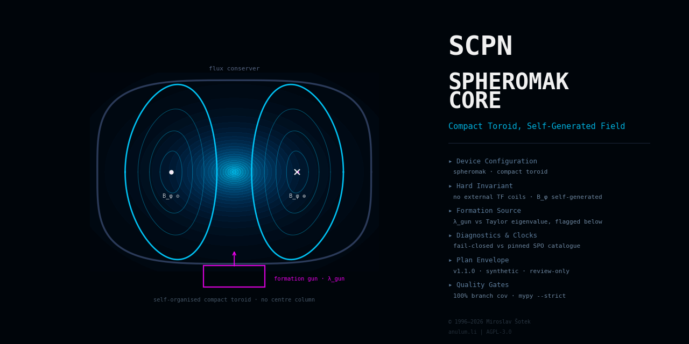

<!--
SPDX-License-Identifier: AGPL-3.0-or-later
Commercial license available
© Concepts 1996–2026 Miroslav Šotek. All rights reserved.
© Code 2020–2026 Miroslav Šotek. All rights reserved.
ORCID: 0009-0009-3560-0851
Contact: www.anulum.li | protoscience@anulum.li
SCPN Spheromak Core — README
-->

<div align="center">
  
</div>

# SCPN Spheromak Core

Governed device-family repository for spheromak fusion systems within the
SCPN Reactor Systems Research Group. This repository is the designated
owner of device-level truth for the `spheromak` configuration of the SCPN
Phase Orchestrator reactor registry (compact toroid).

**Evidence maturity: `computational_prototype`** (per-capability; ADR 0002).
Three capabilities are implemented: the device configuration model —
validated parameter objects with documented consistency estimates,
canonical serialisation, and a data-only SPO registry pin
(evidence: `VALIDATION.md#device-configuration-model`); the
diagnostic and clock semantics model — synthetic channel and clock
declarations aligned fail-closed with the pinned SPO observability
catalogue (ADR 0003, evidence:
`VALIDATION.md#diagnostic-and-clock-semantics`); and the level-0 device
physics — the cylindrical Taylor eigenvalue of the flux conserver, the
relaxed-state field on a declared grid and the formation disposition of
the coaxial source evaluated on the validated configuration through the
pinned shared Bessel and unit-circle kernels of `scpn-reactor-kernels`,
with optional native kernels proven bit-exact against the Python floor
(ADR 0005 and ADR 0006, evidence: `VALIDATION.md#level-0-device-physics`).
No parameter set or channel describes any real machine or diagnostic; the
claim inventory is empty and verified by the domain validator.

## Scope

This repository owns, for the spheromak device family:

- the analytic device physics models: closed-form and 0-D models from the
  spheromak literature evaluated on the validated configuration (no
  solver code, no FUSION seam); the Bessel and unit-circle kernels they
  use are the shared kernel library's, pinned here, not owned here;
- the device boundary: plant and experiment truth, shot lifecycle, and
  configuration policy for simply connected compact toroids whose toroidal
  and poloidal fields are both generated by internal plasma currents near a
  Taylor minimum-energy relaxed state, with no central column and no
  toroidal-field circuit linking the plasma;
- formation and sustainment semantics by magnetised coaxial-gun helicity
  injection, including helicity-balance accounting at device level;
- diagnostic semantics, reference frames, and clock identity declarations;
- actuator-response model boundaries and the declared safety envelope
  (including tilt/shift stability boundaries set by the flux conserver);
- the device-owned CONTROL adapter specification;
- the binding to the SCPN Phase Orchestrator reactor registry
  (version `1.0.0`, digest
  `786d9542ce76c56dd7748fa948b17efed6c073525e527ce90e6d5e29a2d00090`);
- the machine-readable domain manifest `reactor-domain.json` and the derived
  Studio portfolio descriptor (integration state `not_federated`).

## Explicit exclusions

- **Reversed-field pinch** (external toroidal-field circuit, toroidal
  vessel): `SCPN-RFP-CORE`.
- **Field-reversed configuration** (negligible toroidal field):
  `SCPN-FRC-CORE`; the pulsed FRC/MIF merge-compression workflow belongs to
  `SCPN-MIF-CORE`.
- **Axisymmetric tokamaks**: `SCPN-TOKAMAK-CORE`.
- **Solver mathematics and validation evidence**: `SCPN-FUSION-CORE` until
  an exact surface passes the reactor family migration gate; no solver code
  exists in, or was copied into, this repository.
- **Typed signal semantics and comparability**: `SCPN-PHASE-ORCHESTRATOR`
  (review-only output; never actuation).
- **Control admission and action formation**: `SCPN-CONTROL` is the sole
  software authority that forms an admitted `ControlAction`.
- **Machine protection**: independent systems retain the final veto.
- **Portfolio presentation, identity, entitlement, and execution gating**:
  `SCPN-STUDIO`.

## Non-claims

This repository is not machine-ready, not safety-certified, and not
reactor-ready. It contains no implemented solver, no controller, no
experimental correlation, no dataset, and no published artefact; the
level-0 relaxed-state closed forms and their timing benchmark are
computational prototypes, not validated equilibrium, formation or
confinement claims, and no parameter set describes or validates any real
machine. Formation-source choices and fuel-cycle choices are
configuration facets, not separate claims. No capability has reached any
evidence-maturity state beyond `computational_prototype`.

## Architecture

The five-surface boundary and the position of this repository in the SCPN
ecosystem are defined in [`docs/ARCHITECTURE.md`](docs/ARCHITECTURE.md) and
fixed by
[`docs/adr/0001-repository-boundary.md`](docs/adr/0001-repository-boundary.md).
The threat model is in [`docs/THREAT_MODEL.md`](docs/THREAT_MODEL.md); the
CONTROL adapter contract is in
[`docs/CONTROL_ADAPTER_SPECIFICATION.md`](docs/CONTROL_ADAPTER_SPECIFICATION.md).

## Validation

Every gate currently active in this repository is listed in
[`VALIDATION.md`](VALIDATION.md). The local sequence is:

```bash
make lint        # ruff check + ruff format --check
make typecheck   # mypy --strict src tools tests benchmarks
make test        # pytest with 100 % statement and branch coverage on tools/
make validate    # domain manifest, descriptor, and inventory checks
make rust        # format, lint and test the optional native kernels
make preflight   # the full fail-closed gate sequence
```

## Security

See [`SECURITY.md`](SECURITY.md) for the supported states and the private
reporting route (protoscience@anulum.li).

## Licensing

AGPL-3.0-or-later for the public repository, with a commercial licence
available (see [`NOTICE.md`](NOTICE.md)). Licence texts are under
[`LICENSES/`](LICENSES/); machine-readable licensing metadata follows
REUSE 3.x (`REUSE.toml`).

## Citation

Citation metadata is provided in [`CITATION.cff`](CITATION.cff). No release,
version, or DOI exists yet; cite the repository state you inspected.
